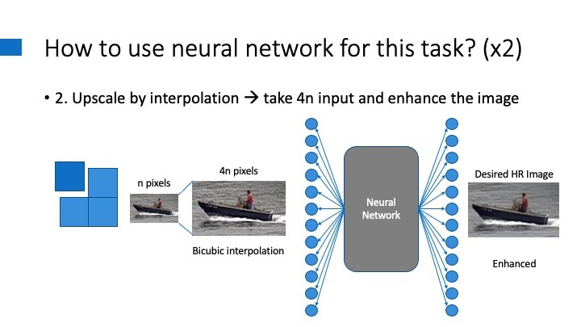

# Super Resolution Practice  
In this project, I learned basics of image super resolutions and investigated the current trend of the technology. This research project was oriented in self-education rather than expanding the frontier.  

## Introduction to Super Resolution  

### Super Resolution  
Image Super Resolution or Image Upscaling refers to a task where bigger sized image is acquired from a smaller image by filling in between existing pixels. In the process, amounts of pixels is increased and the additional pixels’ values are estimated from the information of the smaller picture.  

### Interpolation  
In fact, retrieving reasonable value between two data points, commonly referred as ‘Interpolation’ has been around for a long time. It is a mathematical way to induce numerical value from given information around the interest point.  

  
> Figure 1 - a. Different ways to interpolation a data point, b. Bicubic reconstruction  

Interpolation methods only utilizes information of the surrounding pixels and cannot see the context of a ‘bigger picture’. Although it’s a simple and convenient, interpolated resizing produces consistently bad quality of reconstruction.  

## Image Super Resolution with Machine Learning  

### Brief Introduction to the Traditional Method [1]  
There are several different ways this problem was approached, but unlike the modern trend of SR is in SISR, traditional ways tried to fully utilized information from multiple images.  

  
> Figure 2 - Basic concept of MISR  

Based on image observation theory, low resolution images were products of distortion matrices and the higher resolution counter part of the image. For better understanding, from the equation below:  

  

By solving or optimizing the following equation, higher resolution could be achieved.  

  

There are also frequency domain approach, statistical approach, and example-based approach.  
With the rise of neural networks, more researchers are leaning toward the example-based approach.  

### SISR with neural network  
When thinking of neural network to make bigger size image, you can think of two different methods.  
First is to get a small image and upscale it through the network, and the other way is to interpolate and enlarge the image first and then enhance the image using the network.  

  
> Figure 3 - Two different ways to upscale in SISR with NN

While both methods have their own advantages and disadvantages, namely the second one being free-scale method [2], the first method was a more active field of study. For this reason, this project focused more on learning the first method more.  

### Fully Convolutional Network (FCN) 
The first question in mind of how to implement the neural network was “How can such network take in images regardless of its size, and output the ×r dimension images for each one? This seemed unintuitive how it is done thinking of ordinary fully connected layers in a neural network.  
A layer in any neural network uses fixed number of weights and biases. If a upscaling network uses connection based on feature map pixels in any stage inside of the network, the network will either 1 - restrained to a fixed size input, 2 - resize the given information at some point. 2 is more problematic since that means the network itself can distort the given information.  
For the 1, there are still possible ways to work around the restriction. One is to make a small fixed size input and output network, slice input images with overlapping borders, upscale, and stitch them together with averaging or whichever way suitable with the borders. Another way is to make the input dimension big so it can take in many different sizes of inputs with paddings added.  

> Figure 4 - Possible solutions with fully connected layers  

But both ways have their weakness: border seams or large computation costs.  
This is where a more elegant solution comes in: the Fully Convolutional Network. This type of network does not use any fully connected layer and only uses fixed sized kernel, which can be applied to any size of images.  
First introduced as a useful method for transformative image processing network in Long et al. (2015) [3], it has since been used in many applications.  

### Upscaling Convolutions - Transposed Convolution, Unpooling, Sub-pixel Convolution, Pixel Shuffling  
Another detail in related paper that didn’t immediately make sense was how FCN can upscale the feature maps back to its original size. In convolutional layers, the input image or feature maps are shrunk after convolution or pooling operations.   
There are several methods to enlarge images in neural networks including transposed convolution, sub-pixel convolution, pixel shuffling and unpooling.  

  - Transposed convolution is a method where kernel is multiplied the image’s pixel values and added together in overlapping borders.
  - Sub-pixel convolution is a method where the original image is expanded sparsely and the convolution is operated on it.  
  - Pixel shuffling is a method where r^2 channels of feature map are alternatively placed in order to get a × r dimensions output.

In W Shi et al. [4] these three are well reviewed upon and proven to be equivalent.  

  
> Figure 5 - Transposed Convolution, Sub-pixel Convolution, and Pixel Shuffling  

Unpooling, on the other hand, is a bit different. It is essentially the reverse process of max pooling, and cannot be extended larger than the images’ initial dimensions, at least not as introduced in H. Noh et al. (2015) [5]  

### Datasets for the Upscaling Networks
Compared to other computer vision tasks, preparing the datasets for super resolution network is easier. With a batch of high resolution (HR) images in hand, downsampling these images prepares the HR–LR pair of datasets. However, depending on the downsampling methods the results may differ in train-time and also in test-time.  
Negative effects may include, it might cause subpixel misalignment when calculating the loss between train-time result and ground truth. On the contrary, providing different downsampling methods for corresponding ground truths may make the resulting network to be more robust. For example, although they didn’t specifically use different downscaling methods, B. Lim et al. (2017) [6] used ‘Geometric Self Ensemble’, input image batch with rotated and flipped variants in order to mitigate the bias of single orientation of image.  

### Loss Function  
To train the network, the output should be evaluated in a differentiable way, and in order to evaluate the network output, there must be a way to compare the network output and the ground truth. Most generally used evaluation was mean square error (MSE) or similar variant, peak signal-noise ratio (PSNR) or a more technical way, called structural similarities (SSIM).  

  

These values are simple and straight-forward way to compare two images, but are sensitive to small changes like shifts due to its per-pixel nature. Plus, since they punish by per pixel, blurry but averaged results are encouraged [7]. In other words, these evaluations are not how humans perceive images as “higher resolution”, or “similar to ground truth”.  
To solve this discrepancy, J. Johnson et al. (2016) [8] suggested using image classifier networks’ internal feature map activations to compare two images. By using this method, images can be compared in perceptual levels and are more robust to smaller per pixel distortions.  

> Figure 6 - Perceptual Loss

There is a caveat to using a classifier network as part of the loss function. Since the network is linked at the output, at train-time, the input images should also be fixed sized since the following classifier network requires fixed size. However this is not a problem since the trained kernels can still be used for any size input in test-time. In other words, detaching the loss network after train-time makes our transform net size-free again.  

### Integrating Generative Adversarial Network (GAN) with Super Resolution
At this point, the SISR networks already outputs impressive results with as little effort as just understanding the network structure. Compared to the traditional matrices algebra, this method requires significantly less human input.  
However, the resulting images are still recognizable compared with the original HR images. To be fair for the networks, this is due to the lack of information the low resolution image carry and how much the network should reconstruct. For x4 reconstruction task, the given information and information the network should guess out is 1:15.  
A way to push the frontier further is to train our network as a GAN. The discriminator is fed with either actual original HR image or our network’s output. Our network will be trained to look like a genuine high resolution while making the restoration as similar as possible with the ground truth. Since GAN trains the discriminator to become better at telling which is the upscaled image and the generator (our upscale network) to be better at real-like upscale image, combining GAN loss with the perceptual loss reinforces the realism of the upscaled image.  

> Figure 7 - Original HR, A bit blurry GAN-less SR, GAN integrated SR

## Experiments  

### Denoising by Deconvolution (dividing in frequency domain)  

> Figure 8 - Deconvolution with dividing in frequency domain [13]  

In a CV introduction course I took in KAIST, I learned that since blurring or noise are equivalent to convolution of such effects, finding a proper filter and deconvolving (dividing in Fourier transformed frequency domain) can produce clearer image. So intrigued by this interesting phenomenon, I took the experimenting to myself in this project. The result was a failure.  

  
> Figure 9 - FFT (log) of a gaussian filter and an image (not shifted)  

  
> Figure 10 - Results of the deconvolution. Tried on different variance and noises  

I suspect the failure is mis-calibration of the intensity of the filter. Since dividing with a small number can easily blow up the pixel values, the filter to be Fourier transformed should be more carefully generated.  

### Quantitative Results
The experiment was conducted using OpenCV’s dnn_superres modules and various other super resolution models [9, 10, 11], but only the models from the OPENCV and ESRGAN is presented in this section.  
The table below is based on the test on 114 images from various different common datasets such as set14 and urban100, plus some personal collections. (↓: Lower the better, ↑: Higher the better)  

(x2) Image Restoration  
 Image Restoration")  

(X4) Image Restoration  
 Image Restoration")  

By looking at the quantitative results and seeing at the actual images, I realized that the PSNR and SSIM doesn’t align with the actual perception of ‘high resolution’ or sharpness. Although the ESRGAN didn’t have the best perceptual loss score, the perceptual loss scoring seemed to align the best with the actual human perception.  

### Qualitative Results
.png "HR Pixel Arts")  
> Figure 11 - Pixel arts enlarged and smoothed with EDSR  

  
> Figure 12 - Closer examples of comparisons  

## Conclusion  
During the project, I was able to learn many different aspects of image size modification. Not only for upscaling, but even how downscaling for dataset can affect the final result of the upscaling network.  
Also, by going through various state-of-the-art paper at their own time and historical review of SR techniques, I can confidently say I have better understanding of the field and even have some ideas how to improve the work inspired by the studies.  

## References
[1] J. Yang and T. Huang, "Image super-resolutio: Historical overview and future challenges.," in Super-resolution imaging, CRC Press, 2017, pp. 1-34.  
[2] J. Kim, J. K. Lee and K. M. Lee, "Accurate image super-resoltuion using very deep convolutional networks.," in Proceedings of the IEEE conference on computer vision and pattern recognition, 2016.  
[3] J. Long, E. Shelhamer and T. Darrell, "Fully convolutional networks for semantic segmentation," in Proceedings of the IEEE conference on omputer vision and pattern recognition, 2015.  
[4] W. Shi, J. Caballero, L. Theis, F. Huszar, A. Aitken, C. Ledig and Z. Wang, "Is the deconvolution layer the same as a convolutional layer?," arXiv preprint, 2016.  
[5] H. Noh, H. Seunghoon and B. Han, "Learning deconvolution network for semantic segmentation," in Proceedings of the IEEE international confernce on computer vision, 2015.  
[6] B. Lim, S. Son, H. Kim, S. Nah and K. Mu Lee, "Enhanced deep residual networks for single image super-resolution," in Proceedings of the IEEE conference on computer vision and pattern recognition workshops, 2017.  
[7] C. Ledig, L. Theis, F. Husz{\'a}r, J. Caballero, A. Cunningham, A. Acosta, A. Aitken, A. Tejani, J. Totz, Z. Wang and others, "Photo-realistic single image super-resolution using a generative adversarial network," in Proceedings of the IEEE conference on computer vision and pattern recognition, 2017.  
[8] J. Johnson, A. Alahi and L. Fei-Fei, "Perceptual losses for real-time style transfer and super-resolution.," in European conference on computer vision, 2016.  
[9] K. Nazeri, H. Thasarathan and M. Ebrahimi, "Edge-informed single image super-resolution," in Proceedings of the IEEE/CVF International Conference on Computer Vision Workshops, 2019.  
[10] C. Ma, Y. Rao, Y. Cheng, C. Chen, J. Lu and J. Zhou, "Structure-preserving super resolution with gradient guidance," in Proceedings of the IEEE/CVF Conference on Computer Vision and Pattern Recognition, 2020.  
[11] X. Wang, K. Yu, S. Wu, J. Gu, Y. Liu, C. Dong, Y. Qiao and C. Change Loy, "Esrgan: Enhanced super-resolution generative adversarial networks," in Proceedings of the European conference on computer vision (ECCV) workshops, 2018.   
[12] R. Zhang, P. Isola, A. A. Efros, E. Shechtman and O. Wang, "richzhang/PerceptualSimilarity.git," 2018. [Online]. Available: [https://github.com/richzhang/PerceptualSimilarity](https://github.com/richzhang/PerceptualSimilarity). [Accessed 08 2021].  
[13] Min H. Kim, "CS484: Introduction to Computer Vision
," 2021. [Online] Available: [http://vclab.kaist.ac.kr/cs484/index.html](http://vclab.kaist.ac.kr/cs484/index.html). [Accessed 08 20212]

___
To use anaconda for environment, use the commands in [CONDA ENVIRONMENT CMDS](./CONDA%20ENVIRONMENT%20CMDS.txt)  
For using this repository, use the [[ThisRepo]environment.yml](./[ThisRepo]environment.yml) (env name: SR)  
For [[realESRGAN]](https://github.com/xinntao/Real-ESRGAN), use the [[Real ESRGAN]environment.yml](./[Real%20ESRGAN]environment.yml) (env name: rESRGAN)  